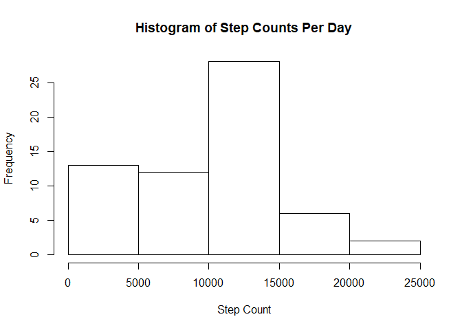
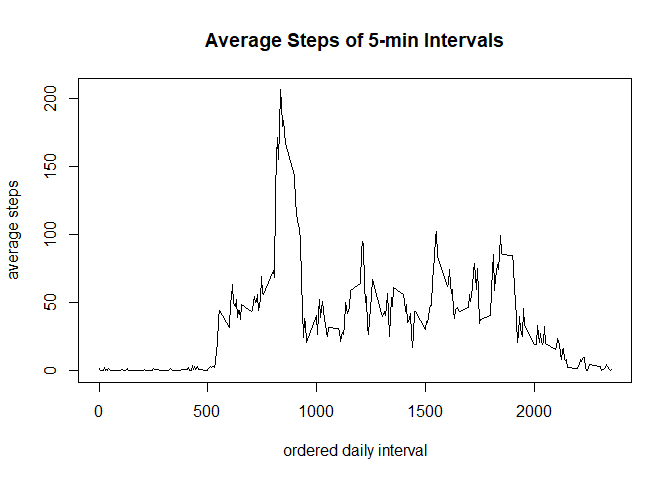
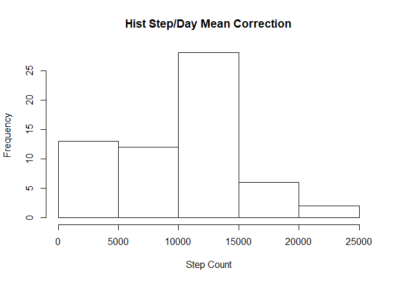
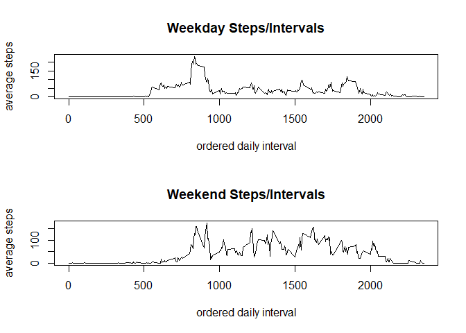

# Reproducible Research: Peer Assessment 1


## Loading and preprocessing the data


In order to load the data file.  One must first unzip the data.  The data file in the repository is using the Zip compression.   It would be possible to talk about the type of algorythim that the Zip compression uses.  However, that would likely just make people board.   So, instead, why don't we just unzip file file using some R code

```r
unzip("activity.zip")
```

Well, once the activity.zip file is uncompressed, it may be noticed that there is now an activity.csv file.   The assignment mentioned that one would be able to read that file with the R read.csv() function.  So, it is now time to read the file into a data frame.


```r
fullActivityData <- read.csv("activity.csv")
```

It seems that the default way of reading the file causes a slight problem.   The date is read in as a factory.  That type of behavior simply won't do.   So, it is quite possible to change the factor into a date and then be happier:


```r
fullActivityData$date <- as.Date(as.character(fullActivityData$date))
```


## What is mean total number of steps taken per day?

The first part of this question heading has the command: 

> Make a histogram of the total number of steps taken each day

So, this is the grouping and summing of the data in order to make a variable holding the sum on a per day basis.  That variable is *stepSumActivityDataPerDay*.


```r
library(dplyr)
stepSumActivityDataPerDay <- fullActivityData %>% group_by(date) %>% summarise_each(funs(sum(., na.rm = TRUE)))
```

Give that such data is now stored.  A histogram can be made to see the data:


```r
hist(stepSumActivityDataPerDay$steps, xlab = "Step Count", main = "Histogram of Step Counts Per Day")
```

<!-- -->

The next part of the assignment commands:

> Calculate and report the **mean** and **median** total number of steps taken per day.


```r
meanStepsPerDay <- mean(stepSumActivityDataPerDay$steps)
medianStepsPerDay <- median(stepSumActivityDataPerDay$steps)
```

It is so much fun to report that the **mean count** of steps per day is **9354.2295082**.

It is even more fun to report that the **median steps** per day is **10395**.


## What is the average daily activity pattern?

So, the first command that the assignment gives for this section is:

> Make a time series plot (i.e. type="l") of the 5-minute interval (x-axis) and average number of steps taken, averaged across all days (y-axis)


```r
meanByIntervalActivityData <- fullActivityData[,c("steps", "interval")]
meanByIntervalActivityData <- meanByIntervalActivityData %>% group_by(interval) %>% summarise_each(funs(mean(., na.rm = TRUE)))

plot(meanByIntervalActivityData$interval, meanByIntervalActivityData$steps, main = "Average Steps of 5-min Intervals", type = "l", ylab = "average steps", xlab = "ordered daily interval")
```

<!-- -->

In this section of the assignment the second thing to answer is a question:

> Which 5-minute interval, on average across all the days in the dataset, contains the maximum number of steps?


```r
intervalWithMaxAvgStepsIndex <- which(meanByIntervalActivityData$steps == max(meanByIntervalActivityData$steps))
intervalWithMaxAvgSteps <- meanByIntervalActivityData[intervalWithMaxAvgStepsIndex, "interval"]
```

Behold the interval with the maximum number of average steps over the period of measurement:  **835**.

## Imputing missing values

The first command of the assignment with reguard to this section is:

> Calculate and report the total number of missing values in the dataset (i.e. the total number of rows with NAs)


```r
totalCountOfMissingSteps <- sum(is.na(fullActivityData$steps))
```

The total number of missing step counts is **2304**.

The next command of the assignment is:

> Devise a strategy for filling in all of the missing values in the dataset.  The strategy does not need to be sophisticated.  For example, you could use the mean/media for that day, or the mean for that 5-minute interval, etc.

Using the following R code, the NA step values are converted to the *median* for the given interval:


```r
indeciesOfNASteps <- which(is.na(fullActivityData$steps))

normalizedFullActivityData <- fullActivityData

for(i in indeciesOfNASteps) {
  normalizedFullActivityData[i, "steps"] <- median(fullActivityData[fullActivityData$interval == normalizedFullActivityData[i, "interval"], "steps"], na.rm = TRUE)
}
```

The above code fullfills the assignment's command:

> Create a new dataset that is equal to the orginal dataset but with the missing data filled in.

Now, there is the next command in the assignment:

> Make a histogram of the total number of steps taken each day and Calculate and report the **mean** and **median** total number of steps taken per day.  Do these values differ from the estimates from the first part of the assignment?  What is the impact of imputing missing data on the estimates of the total daily number of steps?


```r
library(dplyr)

normStepPerDay <- normalizedFullActivityData %>% group_by(date) %>% summarise_each(funs(sum(.,na.rm = TRUE)))

hist(normStepPerDay$steps, xlab = "Step Count", main = "Hist Step/Day Mean Correction")
```

<!-- -->

Now, the thing about the above graph, is, that it really only tells part of the story to understand what is going on with respect to the mean and median.  More calculation is needing to be done:


```r
meanNormStepsPerDay <- as.integer(mean(normStepPerDay$steps))
medianNormStepsPerDay <- as.integer(median(normStepPerDay$steps))
```

The **mean normalized count** of steps per day is **9503**.   The previous estimate for the non-normalized data was 9354.2295082.  So, yes, they differ seemly slightly.

The **median normalized steps** per day is **10395**.  The previous estimate for the non-normalized data was 10395.  So, they don't differ.


## Are there differences in activity patterns between weekdays and weekends?


So, there are two commands in this section of the assignment:

> 1. Create a new factor variable in the dataset with two levels -- "weekday" and "weekend" indicating whether a given date is a weekday or weekend day.
> 2. Make a panel plot containing a time series plot (i.e. type="l") of the 5-minute interval (x-axis) and the average number of steps taken, averaged across all weekday days or weekend days (y-axis).  

The follow code fullfills both commands:


```r
library(dplyr)

wad <- fullActivityData
wad$dayType <- as.factor(sapply(wad$date, function(d) {
  if (grepl("^S", weekdays(d))) { "Weekend" } else { "Weekday" }
}))


wadByIntervalAndDayType <- wad[,c("steps", "interval", "dayType")]
wadByIntervalAndDayType <- wadByIntervalAndDayType %>% group_by(interval,dayType) %>% summarise_each(funs(mean(., na.rm = TRUE)))

par(mfrow = c(2,1))

for(dayType in c("Weekday", "Weekend")) {
  wadCurrent <- wadByIntervalAndDayType[as.character(wadByIntervalAndDayType$dayType) == dayType,] 
  plot(
    wadCurrent$interval, 
    wadCurrent$steps, 
    main = paste(dayType, "Steps/Intervals"), 
    type = "l", 
    ylab = "average steps", 
    xlab = "ordered daily interval")
}
```

<!-- -->


##  Special Note About A Way the Assignment is Outdated

Please note,  when attempting to run the knitr2html() function, the R interpreter informed that function is for an older version of Knitr.  It is quite likely that the assignment was written long ago in a galaxy far far away -- yes, pun intended.  So, in order to render the document nowadays, one should be using the command (commented out here)


```r
# rmarkdown::render("PA1_template.Rmd")
```

This also puts the images in a different directory than what the assignment states.  Such puts the images in a directory matching the filename of the Rmd file, excluding the .Rmd extension.
